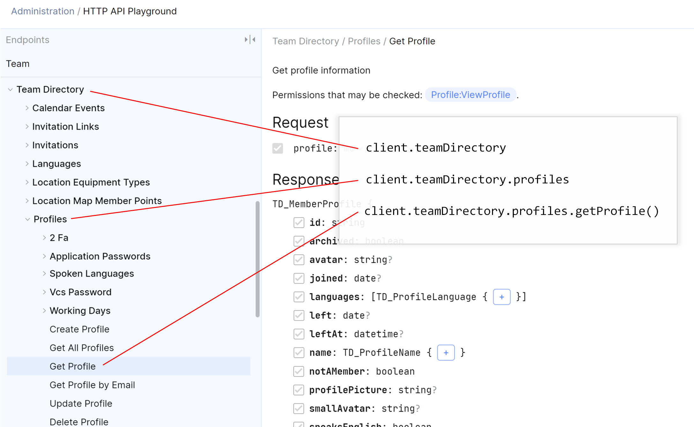

# Space API client

The Space API client is a Kotlin library to work with the [JetBrains Space](https://jetbrains.com/space/) API. 

## Overview

The Space API client comes in two flavours:

* `org.jetbrains:space-api-client-jvm` — Space API client that can be used on the Java Virtual Machine (JVM).
* `org.jetbrains:space-api-client-js` — Space API client that can be used with Kotlin/JS.

Let's have a look at how we can start working with the Space API client.

## Getting Started

We will need to [register an application](https://www.jetbrains.com/help/space/applications.html) to work with the Space API. There are various application types, all supporting different authentication flows. For this example, we will use a *Service Account*.

### Create a Connection

After installing `org.jetbrains:space-api-client-jvm` in our project, we can use the *Client ID* and *Client Secret* of our Service Account to create a `SpaceHttpClient` that can connect to our Space organization:

```kotlin
val spaceClient = SpaceHttpClient(HttpClient())
    .withServiceAccountTokenSource(
        clientId,         // from settings/secrets
        clientSecret,     // from settings/secrets
        organizationUrl)  // i.e. "https://<organization>.jetbrains.space/"
```

We can then use the Space HTTP client in `spaceClient` to access the various Space API endpoint.

The `HttpClient` is a [Ktor client](https://ktor.io/clients/http-client/quick-start/client.html).

> **Note:** Service Accounts have access to a limited set of APIs when using the [Client Credentials Flow](https://www.jetbrains.com/help/space/client-credentials.html). Many actions (such as posting an article draft) require user consent, and cannot be performed with client credentials. For actions that should be performed on behalf of the user, use other authorization flows, such as [Resource Owner Password Credentials Flow](https://www.jetbrains.com/help/space/resource-owner-password-credentials.html).

### Work with a Service Client

Clients for endpoints are exposed on the Space HTTP client, and map to the top level of endpoints we can find in the [HTTP API Playground](https://www.jetbrains.com/help/space/api.html#api-playground):



As an example, the top level *Team Directory* is exposed as `spaceClient.teamDirectory`.

> **Tip:** While not required to work with Space API client, having the [HTTP API Playground](https://www.jetbrains.com/help/space/api.html#api-playground) open will be useful to explore the available APIs and data types while developing.

### Get Profile by Username 

Let's fetch a user profile from the Team Directory:

```kotlin
val memberProfile = spaceClient.teamDirectory.profiles
    .getProfile(ProfileIdentifier.Username("Heather.Stewart"))
```

The `memberProfile` will expose top level properties, such as `id`, `username`, `about`, and more.

To retrieve nested properties, check [nested properties](#nested-properties).

## Space API client

The Space API client provides necessary types to connect to and interact with the Space API.

### Authentication and Connection

Communication with Space is handled by the `SpaceHttpClient` base class. It will require the Space organization URL and an access token to work.

The Space API client provides several extension methods that can be used to authenticate and work with Space:

* `SpaceHttpClient.withServiceAccountTokenSource` — Supports the [Client Credentials Flow](https://www.jetbrains.com/help/space/client-credentials.html). This is typically used by a Service Account that acts on behalf of itself.
* `SpaceHttpClient.withPermanentToken` — Uses a bearer token obtained using [other flows](https://www.jetbrains.com/help/space/oauth-2-0-authorization.html), or a [personal token](https://www.jetbrains.com/help/space/personal-tokens.html). This is typically used by applications that act on behalf of a user.
* `SpaceHttpClient.withCallContext` — Allows integrating other token sources. The `ExpiringTokenSource` can be used to implement the [Refresh Token Flow](https://www.jetbrains.com/help/space/refresh-token.html).

#### Scope

Scope is a mechanism in OAuth 2.0 to limit an application's access to a user's account.

When setting up the `SpaceHttpClient` using the `withServiceAccountTokenSource` extension method, use the `scope` parameter to specify the scope required by an application. By default, Space API client uses the `**` scope, which requests all available scopes.

More [examples of available scopes](https://www.jetbrains.com/help/space/oauth-2-0-authorization.html) are available in the Space documentation.

### Endpoints

Clients for endpoints are exposed on the Space HTTP client, and map to the top level of endpoints we can find in the [HTTP API Playground](https://www.jetbrains.com/help/space/api.html#api-playground):

As an example, the top level *Team Directory* is exposed as `spaceClient.teamDirectory`, with methods that correspond to endpoints seen in the HTTP API Playground.

### Properties, Fields and Partials

In this section, we will cover partial requests and shaping response contents.

#### Background

For most requests, we can shape the results we want to retrieve from the API. In the [HTTP API Playground](https://www.jetbrains.com/help/space/api.html#api-playground), we can toggle checkboxes to include/exclude fields from the result.

When we want to retrieve a user's `id` and `about` description, we can set the `$fields` parameter in an API request to `$fields=id,about`. The API response will then only return those fields.

Fields can be primitive values (integers, strings, booleans, ...), and actual types. As an example, a user profile has a `name` field of type `TD_ProfileName`, which in turn has a `firstName` and `lastName` field. To request this hierarchy, we need to query `$fields=name(firstName,lastName)`.

Being able to retrieve just the information our integration requires, helps in reducing payload size, and results in a better integration performance overall.

In Space API client, we will need to specify the properties we want to retrieve as well. Let's see how this is done.

#### Top-level Properties by Default

By default, Space API client will retrieve all top level properties from the Space API. For example, retrieving a profile from the team directory will retrieve all top level properties, such as `id`, `username`, `about`, and more:

```kotlin
val memberProfile = spaceClient.teamDirectory.profiles
    .getProfile(ProfileIdentifier.Username("Heather.Stewart"))
```

A `TD_MemberProfile`, which is the type returned by `getProfile`, also has a `managers` property. This property is a collection of nested `TD_MemberProfile`, and is not retrieved by default.

#### Nested Properties

Nested properties have to be retrieved explicitly. For example, if we want to retrieve the `managers` for a user profile, including the manager's name, we would have to request these properties by extending the default partial result:

```kotlin
val memberProfile = spaceClient.teamDirectory.profiles
    .getProfile(ProfileIdentifier.Username("Heather.Stewart")) {
        defaultPartial()        // with all top level fields
        managers {              // include managers
            id()                //   with their id
            username()          //   and their username
            name {              //   and their name
                firstName()     //     with firstName
                lastName()      //     and firstName
            }
        }
    }
```

The Space API client will help with defining properties to include. Let's say we want to retrieve only the `id` and `username` properties for a profile:

```kotlin
val memberProfile = spaceClient.teamDirectory.profiles
    .getProfile(ProfileIdentifier.Username("Heather.Stewart")) {
        id()
        username()
    }
```

When we try to access the `name` property for this profile, which we did not request, Space API client will throw an `IllegalStateException` with additional information.

```kotlin
try {
    // This will fail...
    println("${memberProfile.name.firstName} ${memberProfile.name.lastName}")
} catch (e: IllegalStateException) {
    // ...and we'll get a pointer about why it fails:
    // Property 'name' was not requested. Reference chain: getAllProfiles->data->[0]->name
    println("The Space API client tells us which partial query should be added to access the property:");
    println(e.message)
}
```

Let's look at some other extension methods for retrieving partial responses.

#### Partial Methods

As demonstrated in the previous section, all builder methods (such as `id()`) are methods to help build the partial response based on a property name of an object. There are some other methods and overloads that can be used when building partial responses.

Utility methods:

* `defaultPartial()` — Adds all fields at the current level (uses the `*` field definition under the hood).

Utility overloads exist for retrieving recursive results. For example, if we want to retrieve a user profile and their managers with the same fields, we can use the `managers(this)` overload:

```kotlin
val memberProfile = spaceClient.teamDirectory.profiles
    .getProfile(ProfileIdentifier.Username("Heather.Stewart")) {
        defaultPartial()  // with all top level fields
        managers(this)    // and the same fields for all managers
    }
```

#### Inheritance

The Space API may return polymorphic responses. In other words, there are several API endpoints that return subclasses.

One such example is `spaceClient.projects.planning.issues.getAllIssues()`, where the `createdBy` property can be a subclass of `CPrincipalDetails`:

* `CAutomationTaskPrincipalDetails`, when the issue was created by an automation task.
* `CBuiltInServicePrincipalDetails`, when the issue was created by Space itself.
* `CExternalServicePrincipalDetails`, when the issue was created by an external service.
* `CUserWithEmailPrincipalDetails`, when the issue was created by a user that has an e-mail address.
* `CUserPrincipalDetails`, when the issue was created by a user.

// TODO FROM HERE - Arkady how can these be retrieved?
By default, these instances will only contain properties from the `CPrincipalDetails` interface. To retrieve specific properties of inherited types, we have to use the `.ForInherited<TInherited>()` extension method, and build the partial response for that specific inheritor.

Here's an example retrieving issues from a project. For the `CreatedBy` property, we are defining that the response should contain:

* `CUserPrincipalDetailsDto` with the `User.Id` property.
* `CUserWithEmailPrincipalDetailsDto` with the `Name` and `Email` properties.

```csharp
await foreach (var issueDto in _projectClient.Planning.Issues.GetAllIssuesAsyncEnumerable(
    ProjectIdentifier.Key("ABC"), IssuesSorting.UPDATED,
    partial: _ => _
        .WithAllFieldsWildcard()
        .WithCreationTime()
        .WithCreatedBy(createdBy => createdBy
            .WithDetails(details => details
                .ForInherited<CUserPrincipalDetailsDto>(detailsDto => detailsDto
                    .WithUser(user => user
                        .WithId()))
                .ForInherited<CUserWithEmailPrincipalDetailsDto>(detailsDto => detailsDto
                    .WithName()
                    .WithEmail())))
        .WithStatus()))
{
    if (issueDto.CreatedBy.Details is CUserPrincipalDetailsDto userPrincipal)
    {
        // ... work with CUserPrincipalDetailsDto ...
    }
    if (issueDto.CreatedBy.Details is CUserWithEmailPrincipalDetailsDto userWithEmailPrincipal)
    {
        // ... work with CUserWithEmailPrincipalDetailsDto ...
    }
}
```

We can cast these types, use `switch` expressions on their type, and more.
// TODO END UNTIL HERE

### Batch and `IAsyncEnumerable`

// @Arkady does something similar exist in the Kotlin client now, or drop this section?

Many operations in the Space API return a collection of results. To guarantee performance, these responses will be paginated, and can be retrieved in batches.

A batch will always return the total count of items that will be returned after fetching all pages, and contains the data as well:

```csharp
public class Batch<T>
{
    List<T>? Data { get; }
    string? Next { get; }
    int? TotalCount { get; }

    bool HasNext();
}
```

We have to specify the properties of the `Batch` type to retrieve, and all the fields of the data type we need

As an example, let's retrieve the current user's To-Do items for this week, skipping the first 10 items, with their `Id`, `Content` and `Status`:

```csharp
var batch = await _todoClient.GetAllToDoItemsAsync(
    from: weekStart.AsSpaceDate(),
    partial: _ => _
        .WithData(data => data
            .WithId()
            .WithContent(content => content
                .ForInherited<TodoItemContentMdTextDto>(md => md
                .WithAllFieldsWildcard()))
            .WithStatus())
        .WithTotalCount()
        .WithNext());

do
{
    foreach (var todoDto in batch.Data)
    {
        // ...
    }
    
    batch = await _todoClient.GetAllToDoItemsAsync(
        from: weekStart.AsSpaceDate(),
        skip: batch.Next,
        partial: _ => _ /* ... */);
}
while (batch.HasNext());
```

The resulting `batch` will contain one page of results. To retrieve more To-Do items, we will have to make additional API calls. This gets cumbersome rather quickly, which is why API endpoints that return a `Batch<T>` also have an overload that supports `IAsyncEnumerable`.

With the `IAsyncEnumerable` overload for these endpoints, we can iterate over items that are returned. The underlying Space API client implementation will handle pagination and additional API calls for us. The same example as before, using the `IAsyncEnumerable` overload:

```csharp
await foreach (var todoDto in _todoClient.GetAllToDoItemsAsyncEnumerable(
    from: weekStart.AsSpaceDate(),
    partial: _ => _
        .WithId()
        .WithContent(content => content
            .ForInherited<TodoItemContentMdTextDto>(md => md
                .WithAllFieldsWildcard()))
        .WithStatus()))
{
    // ...
}
```

The [`System.Linq.Async`](https://www.nuget.org/packages/System.Linq.Async) NuGet package may assist in using `IAsyncEnumerable`, with utilities like `FirstOrDefaultAsync()` and more.

> **Tip:** To retrieve the total result count, without any other properties, don't use the `IAsyncEnumerable` overload. 
>
> Instead, retrieve just the `TotalCount` property for this batch:
>
> ```csharp
> var batch = await _todoClient.GetAllToDoItemsAsync(
>     from: weekStart.AsSpaceDate(), partial: _ => _.WithTotalCount());
> var numberOfResults = batch.TotalCount;
> ```
